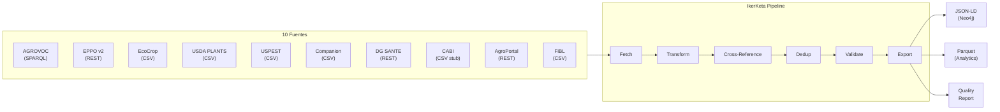

# IkerKeta

**Pipeline de adquisición de datos agronómicos para NKZ-BioOrchestrator.**

IkerKeta (del euskera «ikerketa» = investigación) es un sistema ETL extensible que recolecta, normaliza y unifica datos agronómicos de 18 fuentes abiertas e institucionales en 5 dominios: taxonomía, fitosanitario, edafoclimático, ganadería, y silvicultura. Su salida — JSON-LD y Parquet — alimenta directamente al grafo de conocimiento Neo4j del módulo NKZ-BioOrchestrator.

> **Licencia:** AGPL-3.0-or-later · **Python:** ≥ 3.11

---

## Arquitectura



---

## Instalación

```bash
git clone <repo> && cd IkerKeta

# Entorno virtual
python3 -m venv .venv && source .venv/bin/activate

# Instalar con dependencias de desarrollo
pip install -e ".[dev]"

# Copiar y configurar variables de entorno
cp .env.example .env
# Editar .env con tus API keys (EPPO_API_TOKEN, etc.)
```

---

## Uso

### CLI

```bash
# Listar fuentes configuradas
ikerketa sources

# Estado del pipeline (directorios, ficheros)
ikerketa status

# Fetch individual
ikerketa fetch eppo --limit 10
ikerketa fetch agrovoc --limit 50

# Pipeline completo (fetch → crossref → dedup → export)
ikerketa pipeline --limit 100

# Pipeline con fuentes específicas
ikerketa pipeline -s ecocrop -s usda_plants -s uspest --limit 500

# Sin exportación (solo transformación y validación)
ikerketa pipeline --limit 100 --no-export

# Ver último informe de calidad
ikerketa report
```

### Datos locales (CSV)

Las fuentes sin API pública requieren descarga manual a `data/raw/`:

| Fuente | Archivo esperado | Origen |
|---|---|---|
| EcoCrop | `data/raw/ecocrop.csv` | [GAEZ v5](https://gaez.fao.org/pages/ecocrop-find-plant) |
| USDA PLANTS | `data/raw/plantlst.txt` | [USDA Complete Checklist](https://plants.usda.gov) |
| USPEST | `data/raw/uspest_gdd_models.csv` | [USPEST.org](http://uspest.org/wea/) modelos GDD |
| Companion | `data/raw/companion_planting.csv` | Datasets curados de GitHub |
| CABI | `data/raw/cabi_natural_enemies.csv` | Requiere licencia institucional |
| FiBL | `data/raw/fibl_inputs.csv` | [inputs.eu](https://www.inputs.eu) |
| DG SANTE | `data/raw/dg_sante.csv` *(fallback)* | [EU Pesticides DB](https://ec.europa.eu/food/plant/pesticides/eu-pesticides-database/) |

---

## Estructura del Proyecto

```
IkerKeta/
├── ikerketa/
│   ├── cli.py                  # CLI (typer + rich)
│   ├── config.py               # Configuración (pydantic-settings)
│   ├── pipeline.py             # Orquestador ETL
│   ├── report.py               # Generador de informes de calidad
│   ├── security.py             # Gestión de secrets + sanitización
│   ├── logging_setup.py        # Logging estructurado (structlog)
│   ├── connectors/             # Un módulo por fuente (10 conectores)
│   │   ├── base.py             # AbstractConnector (retry, rate-limit)
│   │   ├── agrovoc.py          # SPARQL → OntologyConcept
│   │   ├── eppo.py             # REST v2 → Taxon / Pest
│   │   ├── ecocrop.py          # CSV → Crop (edaphic + climatic)
│   │   ├── usda_plants.py      # CSV → Taxon (USDA symbol)
│   │   ├── uspest.py           # CSV → Pest (GDDModel)
│   │   ├── companion_planting.py  # CSV → CompanionRelation
│   │   ├── dg_sante.py         # REST + CSV → ActiveSubstance
│   │   ├── cabi.py             # CSV stub → NaturalEnemy
│   │   ├── agroportal.py       # REST → OntologyConcept
│   │   └── fibl.py             # CSV → ActiveSubstance (orgánico)
│   ├── models/                 # Modelos Pydantic (7 tipos de entidad)
│   │   ├── base.py             # BaseEntity, BaseRelationship, DataSource
│   │   ├── taxonomy.py         # Taxon, TaxonSynonym
│   │   ├── crop.py             # Crop, EdaphicProfile, ClimaticProfile
│   │   ├── pest.py             # Pest, GDDModel, LifeStage
│   │   ├── relationship.py     # HostAssociation, CompanionRelation, NaturalEnemy
│   │   ├── regulation.py       # ActiveSubstance, MRLEntry, Regulation
│   │   └── ontology.py         # OntologyConcept, SemanticRelation
│   ├── transform/              # Normalización y cruce
│   │   ├── normalizer.py       # °F→°C, nombres taxonómicos, pH
│   │   ├── crossref.py         # CrossReferenceIndex (AGROVOC↔EPPO↔USDA)
│   │   └── dedup.py            # Hash, key, y fuzzy deduplication
│   ├── validate/
│   │   └── rules.py            # Reglas de QC (temperaturas, GDD, etc.)
│   └── export/
│       ├── jsonld.py           # JSON-LD para Neo4j (n10s)
│       └── parquet.py          # Parquet columnar (pandas/DuckDB)
├── configs/
│   └── sources.yaml            # Registro de fuentes de datos
├── data/                       # Datos (gitignored)
│   ├── raw/                    # CSVs descargados
│   ├── processed/              # JSON-LD + Parquet exportados
│   └── reports/                # Informes de calidad (JSON)
├── tests/                      # 85 tests (76 unit + 9 integración live)
│   ├── fixtures/               # CSVs con datos agronómicos reales
│   ├── test_connectors/
│   ├── test_transform/
│   ├── test_validate/
│   └── test_pipeline.py
├── pyproject.toml
├── .env.example
└── .gitignore
```

---

## Modelo de Datos

Todas las entidades heredan de `BaseEntity` con trazabilidad completa:

| Campo | Descripción |
|---|---|
| `source_name` | Fuente de origen (enum `DataSource`) |
| `ingestion_timestamp` | UTC timestamp de ingesta |
| `data_hash` | XXHash de integridad |
| `agrovoc_uri` | Clave universal (AGROVOC) |
| `eppo_code` | Clave fitosanitaria (EPPO) |
| `usda_symbol` | Clave taxonómica (USDA) |
| `raw_record` | Registro original para auditoría |

### Entidades

| Tipo | Fuentes | Contenido |
|---|---|---|
| `Taxon` | EPPO, USDA | Taxonomía: nombre científico, familia, género, sinónimos |
| `Crop` | EcoCrop | `EdaphicProfile` (pH, textura, fertilidad) + `ClimaticProfile` (T, precipitación, ciclo) |
| `Pest` | EPPO, USPEST | `GDDModel` (Tbase, Tmax, lifecycle stages) + quarantine status |
| `OntologyConcept` | AGROVOC, AgroPortal | Labels multilingüe, broader/narrower URIs |
| `ActiveSubstance` | DG SANTE, FiBL | Aprobación EU, compatibilidad orgánica, MRLs |

### Relaciones

| Tipo | Fuentes | Contenido |
|---|---|---|
| `HostAssociation` | EPPO, CABI | Pest → Host plant |
| `CompanionRelation` | Companion | Crop ↔ Crop (HELPS/HURTS/ATTRACTS/REPELS) |
| `NaturalEnemy` | CABI | Predator/parasitoid → Pest (biocontrol) |
| `SemanticRelation` | AGROVOC, AgroPortal | Broader/narrower/related ontology links |

---

## Cross-Referencing

El módulo `crossref.py` unifica identifiers entre fuentes:

```
AGROVOC URI ↔ EPPO Code ↔ USDA Symbol
```

Prioridad de resolución: EPPO → AGROVOC → USDA → nombre científico (exact) → nombre científico (fuzzy, Jaro-Winkler ≥90%).

---

## Tests

```bash
# Tests unitarios (sin red) — 76 tests, ~2s
pytest tests/ -m "not slow"

# Tests de integración live (requieren red + API keys)
pytest tests/ -m "slow"

# Todos
pytest tests/

# Con coverage
pytest tests/ --cov=ikerketa --cov-report=term-missing
```

---

## Seguridad

| Aspecto | Implementación |
|---|---|
| **Secrets** | Variables de entorno (`.env`). Nunca en código. |
| **SPARQL** | Solo URIs estáticas. Sin concatenación de input de usuario. |
| **Rate limiting** | Por conector: AGROVOC 0.5s, EPPO 0.18s+ventana 60/10s, DG SANTE 0.5s, AgroPortal 1.0s |
| **Retry** | `tenacity` con backoff exponencial. Respeto a `Retry-After`. |
| **Integridad** | XXHash por registro. Verificación entre ejecuciones. |
| **Audit** | `pip-audit` (0 CVEs). `ruff` + `mypy --strict`. |
| **Gitignore** | `.env`, `.key`, `data/raw/`, `data/processed/`, `data/reports/` |

---

## Variables de Entorno

```bash
# .env
EPPO_API_TOKEN=tu_token_eppo        # Requerido para conector EPPO
AGROVOC_SPARQL_ENDPOINT=https://agrovoc.fao.org/sparql  # Default
LOG_LEVEL=INFO                       # DEBUG, INFO, WARNING, ERROR
HTTP_TIMEOUT_SECONDS=30
HTTP_MAX_RETRIES=3
```

---

## Dependencias

| Librería | Uso |
|---|---|
| `pydantic` / `pydantic-settings` | Modelos de datos tipados + configuración |
| `httpx` | Cliente HTTP async-compatible |
| `tenacity` | Retry con backoff exponencial |
| `SPARQLWrapper` | Queries SPARQL a AGROVOC |
| `pandas` + `pyarrow` | Exportación Parquet |
| `rdflib` + `pyld` | JSON-LD linked data |
| `structlog` | Logging estructurado JSON |
| `typer` + `rich` | CLI con tablas y colores |
| `xxhash` | Hashing rápido de integridad |
| `rapidfuzz` | Fuzzy matching taxonómico |

---

## Roadmap

- [ ] Exportación directa a Neo4j via `n10s`/`apoc.load.json`
- [ ] Scheduler (cron/Airflow) para ingestas incrementales
- [ ] Dashboard web de calidad de datos
- [ ] Extensión a dominios: ganadería, silvicultura, acuicultura
